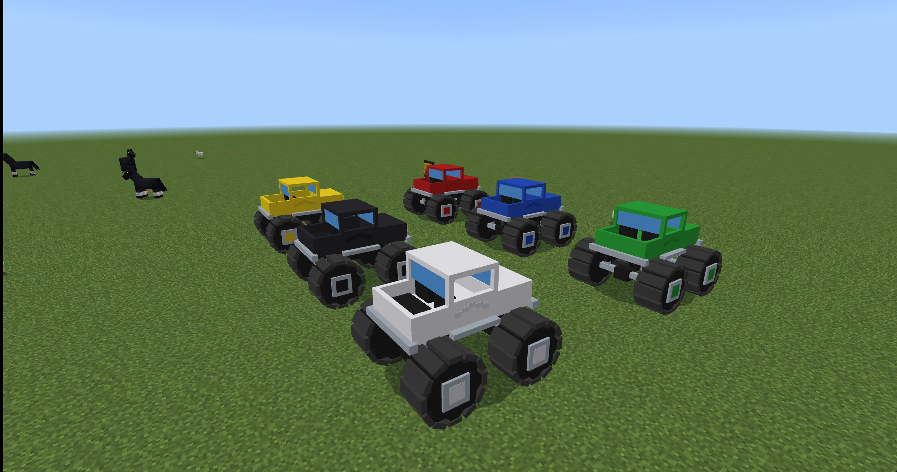
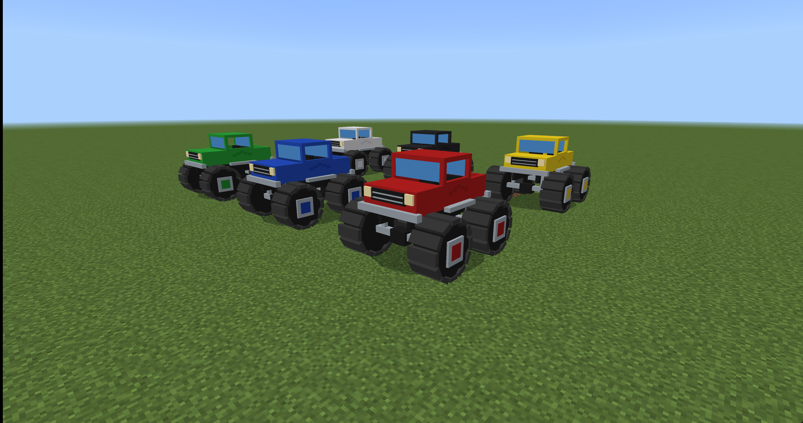

# Monster Truck for Minecraft Bedrock

A lifted, two-seat monster pickup with oversized octagonal tires, chunky tread, exposed axles and suspension, an open cargo bed, and six paint colors. Includes engine audio, survival crafting, and controlled two-block auto-step.



## Choose a color

Trucks spawn **red**. To repaint one, hold the matching Minecraft dye, **sneak**, and **interact with the truck** (Shift + right-click on Windows). Dye is reusable and is not consumed. Interact normally to mount the truck.

| Paint | Item |
|---|---|
| Red | Red dye |
| Blue | Blue dye |
| Green | Green dye |
| Yellow | Yellow dye |
| Black | Black dye |
| White | White dye |



Colors change the body, hood, roof, and wheel-hub accents. Tires stay dark, with silver metalwork and pale headlights.

## Heavy-duty stats

| Stat | Value |
|---|---|
| Health | 1,000 HP (500 hearts) |
| Melee, projectile and explosion damage received | 25% of normal |
| Fall damage | None |
| Movement attribute | 0.55 (was 0.40) |
| Auto-step height | 2 blocks |
| Run-over damage | 40 HP, with a 0.5-second cooldown |

Run-over damage activates only while the truck is moving and a mob is within contact range. It also affects untamed animals; players, tamed pets and other vehicles are excluded. This is a short-range contact attack, not exact wheel-by-wheel collision. Tough mobs can survive a hit. Terrain settings support stepped ground; the truck does not break blocks, fly, or bridge gaps.

## Install and play

1. Build the add-on with `powershell.exe -NoProfile -File .\Test-Addon.ps1 -Mode Static`.
2. Open `dist/MonsterTruck.mcaddon` to import it into Minecraft Bedrock for Windows.
3. Activate **Monster Truck Behavior** in a world's Behavior Packs; its resource pack is linked automatically.
4. Use the Creative spawn egg, the [survival recipe](docs/RECIPE_GUIDE.md), or `/summon blake:monster_truck ~ ~ ~`.

The truck has a driver seat and a passenger seat. Use normal movement controls while driving and sneak to dismount. See the [proving-ground guide](docs/PROVING_GROUND.md) for the controls and obstacle checklist.

## Automated tests and screenshots

With Python 3.11+ installed and Minecraft initialized and closed, run:

```powershell
powershell.exe -NoProfile -File .\Test-Addon.ps1
```

The command prepares its Python environment, creates a dedicated flat test world, enables content logging with a settings backup, deploys the test packs, and launches Minecraft. It checks all six color events, the required components, both seats, armor, fall protection, parked contact safety, moving run-over damage, and a two-block ledge crossed using horizontal impulses; collects screenshots from multiple camera angles; checks the final content log; and closes the client normally.

Reports and original screenshots are under `dist/bedrock-tests/<run-id>/`. The images above are actual Minecraft captures from that workflow. Showcase trucks stay in the dedicated test world for inspection and are replaced on the next run. Other worlds are not used for testing.

Screenshots document appearance; automated color-event checks do not simulate a player's dye click or driving controls. Those interactions remain in the [manual proving-ground checklist](docs/PROVING_GROUND.md).

See [Windows testing](docs/WINDOWS_TESTING.md) for configuration and the reusable `minecraft-addon-testing` skill. The distributed add-on remains data-only; its script harness is confined to the test world.
