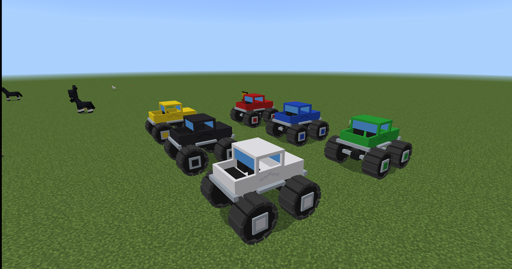
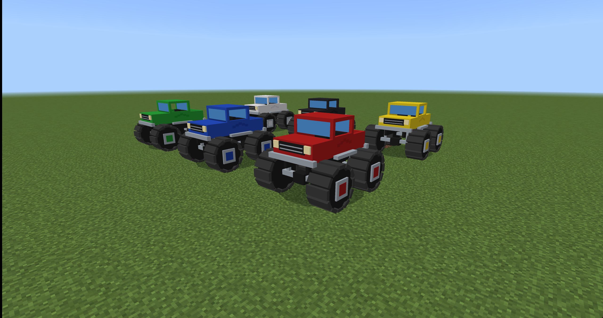

# Monster Truck for Minecraft Bedrock

A lifted, two-seat monster pickup with oversized octagonal tires, chunky tread, exposed axles and suspension, an open cargo bed, and sixteen paint colors. Includes authentic engine audio, survival crafting, controlled two-block auto-step, dynamic incline pitch, coordinated four-wheel steering, wood demolition, foliage shearing, handbrake drifts, and amphibious liquid traversal.



## Choose a color

Vehicles spawn in a randomized color when placed using the Creative spawn egg. The distinct Survival Vehicle Item produced by the recipe places a **red** truck, and a bare `/summon blake:monster_truck` also defaults to red. To repaint one, hold any of the 16 vanilla Minecraft dyes, **sneak**, and **interact with the truck** (Shift + right-click on Windows). Dye is reusable and is not consumed. Interact normally without sneaking to mount the truck.

| Paint | Item | Paint | Item |
|---|---|---|---|
| Red | Red dye | Light Blue | Light Blue dye |
| Blue | Blue dye | Lime | Lime dye |
| Green | Green dye | Pink | Pink dye |
| Yellow | Yellow dye | Gray | Gray dye |
| Black | Black dye | Light Gray | Light Gray dye |
| White | White dye | Cyan | Cyan dye |
| Orange | Orange dye | Purple | Purple dye |
| Magenta | Magenta dye | Brown | Brown dye |



Colors change the body, hood, roof, and wheel-hub accents. Tires stay dark, with silver metalwork and pale headlights.

## Heavy-duty stats & abilities

| Stat | Value |
|---|---|
| Health | 1,000 HP (500 hearts) |
| Damage received (melee, projectile, explosion) | 25% of normal |
| Fall damage | None (100% Pneumatic Shock Absorption) |
| Movement attribute | 0.55 |
| Controlled Auto-step height | 2 blocks |
| Top speed | About 22 blocks/s on land, water, and lava (reverse at a third) |
| Handbrake | Hold Space: hard stop, or a drift while steering |
| Tire Trample damage | Speed-scaled (up to lethal impact) with outward knockback |
| Retrieval | A direct player-fatal dismantle returns exactly one Vehicle Item |
| Catastrophic destruction | Combat, explosions, fire, lava, and other hazards drop Scrap |

The Monster Truck is built for extreme demolition and all-terrain traversal:
- **Controlled Auto-Step**: Climbs 2-block vertical ledges smoothly without requiring jump input.
- **Wood Demolition & Foliage Shearing**: Smashes through wooden logs, planks, fences, and glass windows at momentum (dropping materials), while shearing leaves and vines on contact without drops to prevent entity lag.
- **Handbrake Drift**: Hold Space to lock the rear wheels: stop hard in a straight line, or steer at speed to swing the rear out and slide through the turn.
- **Crush Stomp**: Landing from a drop of 3 or more blocks deals a 60+ damage radial Crush Stomp to mobs beneath.
- **Amphibious Flotation & Shoreline Step-Up**: Oversized tires cruise across water and lava lakes at overland speeds, shielding seated riders from heat, and climbing back onto dry land automatically.
- **Molten Tire Trample**: Traversing lava superheats the wheels for 10 seconds, setting impacted mobs ablaze upon collision.
- **Dynamic Incline Pitch & Coordinated Four-Wheel Steering**: Dual-axle ground contour probing tilts the chassis up to $\pm 35^\circ$ on hills, while A/D turn the front wheels and the rear wheels counter-steer up to $\pm 18^\circ$, springing back to center on release.

## Install and play

1. Build the add-on with `powershell.exe -NoProfile -File .\Test-Addon.ps1 -Mode Static`.
2. Open `dist/MonsterTruck.mcaddon` to import it into Minecraft Bedrock for Windows.
3. Activate **Monster Truck Behavior** in a world's Behavior Packs; its resource pack is linked automatically.
4. Use the Creative spawn egg, the [survival recipe](docs/RECIPE_GUIDE.md), or `/summon blake:monster_truck ~ ~ ~`.

The truck has a driver seat (Seat 0, left door) and a passenger seat (Seat 1, right door). Drive with W (forward), S (brake, then reverse), and A/D (steer the wheels; the truck turns only while moving). Hold Space for the handbrake. The mouse only looks around. Sneak (Shift) dismounts. See the [proving-ground guide](docs/PROVING_GROUND.md) for the controls and obstacle checklist.

## Automated tests and screenshots

With Python 3.11+ installed and Minecraft initialized and closed, run:

```powershell
powershell.exe -NoProfile -File .\Test-Addon.ps1
```

The command prepares its Python environment, creates a dedicated flat test world, enables content logging with a settings backup, deploys the test packs, and launches Minecraft. It checks all 16 explicit color events, randomized and deterministic spawn-source behavior, required components, both seats, armor, fall protection, parked contact safety, moving run-over damage, and a two-block ledge; collects screenshots from multiple camera angles; checks the final content log; and closes the client normally.

Reports and original screenshots are under `dist/bedrock-tests/<run-id>/`. The images above are actual Minecraft captures from that workflow. Showcase trucks stay in the dedicated test world for inspection and are replaced on the next run. Other worlds are not used for testing.

The runner never generates keyboard input. Real-keyboard A/D steering and Space handbrake, the visible drift, control feel, dye interaction, visual quality, camera comfort, audio playback, and multiplayer behavior remain in the [manual proving-ground checklist](docs/PROVING_GROUND.md).

See [Windows testing](docs/WINDOWS_TESTING.md) for configuration and the reusable `minecraft-addon-testing` skill. Production vehicle physics, demolition, kinematics, and amphibious traversal are powered by the Bedrock Script API (`@minecraft/server`).
