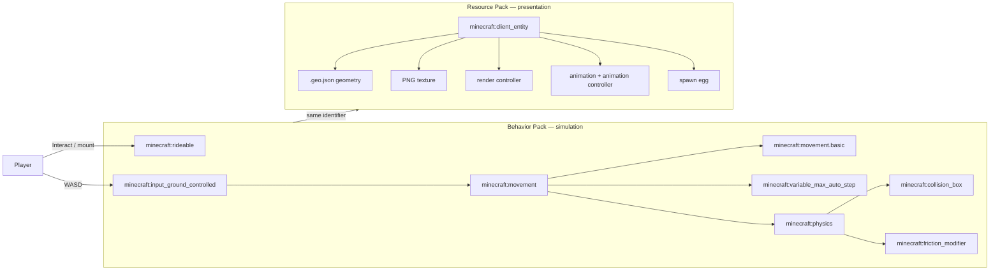
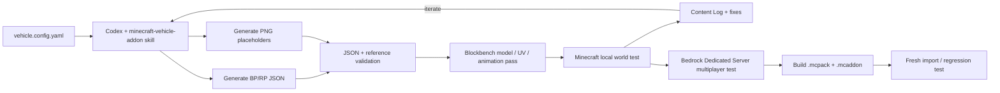

# Minecraft Monster Truck Add-On: Bedrock-First Technical Design, Asset Pipeline, and Codex Automation

## Executive summary

The most practical implementation is a **Bedrock Edition data-driven custom entity** split across a behavior pack and resource pack. The behavior side owns the truck's rideability, player control, movement, collision, friction, health, and step-climbing behavior; the resource side owns its client entity, model geometry, texture, render controller, animations, localization, and spawn egg. Microsoft explicitly documents `minecraft:rideable` for seats and riders, while `minecraft:input_ground_controlled` gives a rideable entity direct WASD control. citeturn22view0turn22view1

There is an important versioning wrinkle in September 2026. Mojang's public Bedrock release line has progressed beyond the main 26.40 release through hotfixes, while the latest stable `bedrock-samples` release is **v1.26.40.05**, tied to Bedrock 26.40; preview samples are already on later preview lines. The stable Mojang sample manifests use `"format_version": 2` and `"min_engine_version": [1, 26, 40]`. For a new add-on, I would therefore author and validate against the stable **1.26.40 creator baseline** and then test on the currently installed stable Bedrock hotfix, rather than quietly taking dependencies on preview schemas. citeturn19search1turn19search2turn24view0turn24view1

For the monster-truck prototype, the key behavior components should be `minecraft:movement`, `minecraft:movement.basic`, `minecraft:rideable`, `minecraft:input_ground_controlled`, `minecraft:variable_max_auto_step`, `minecraft:physics`, `minecraft:collision_box`, and—optionally—`minecraft:friction_modifier` and `minecraft:knockback_resistance`. The recommended starting values in this report—movement `0.40`, maximum turn `18` degrees/tick, one-block auto-step, friction `1.15`, and 60 health—are **design choices**, not Mojang-prescribed vehicle values. Mojang describes typical movement values around 0.2–0.35 for several vanilla mobs and defines `max_turn` in degrees per tick. citeturn23view1turn23view2

The biggest technical limitation is collision. Bedrock's standard entity collider exposes **one `width` that applies to both width and depth**, plus a height. A long rectangular monster truck therefore cannot have a native rectangular chassis collider, let alone four independent tire contact patches, using this component alone. Its visible geometry can be four blocks long while the gameplay collider remains approximately square. Consequently, wheel rotation and suspension travel should initially be treated as **visual animation**, not as true four-wheel vehicle dynamics. citeturn22view2

A one-block controlled auto-step is a good fit for the monster-truck fantasy. Microsoft specifically recommends considering `minecraft:variable_max_auto_step` for ground-controlled rideables because their normal default auto-step is half a block; the component exposes separate base, player-controlled, and jump-prevented values. citeturn22view1turn23view0

For friction, use a behavior entity `format_version` of at least **`1.26.20`**. Microsoft corrected `minecraft:friction_modifier` at that format level so higher numbers now mean more ground friction—`0` none, `1` regular, `2` double—and new content should not need the legacy behavior. citeturn22view3

The art pipeline should center on **Blockbench**. Bedrock models are JSON geometry associated with textures through the client entity/render-controller system, and Blockbench has a dedicated Bedrock model workflow. Its `.bbmodel` file is best kept as **editable source**, whereas the game consumes exported Bedrock geometry JSON. citeturn20search4turn20search24

The recommended custom spawn egg is a transparent **16×16 PNG**. Microsoft's Entity Wizard explicitly recommends that size for custom egg textures and recommends **64×64 PNG** for optional pack icons. A colored vanilla-style egg using `base_color` and `overlay_color` is also possible, but the custom texture is preferable here because a tiny truck silhouette immediately distinguishes the item. citeturn23view3turn25view3

The Codex assumption in the request needs one correction: **current native Codex skills are not standalone JSON or YAML files**. A skill is a directory whose required file is `SKILL.md`, containing YAML front matter with `name` and `description`, with optional `scripts/`, `references/`, `assets/`, and `agents/openai.yaml`. JSON or YAML are excellent choices for the *vehicle configuration consumed by the skill*, so I provide both `vehicle.config.json` and `vehicle.config.yaml`. Codex can discover repository skills under `.agents/skills`, and CLI/IDE users can explicitly invoke one using `$skill-name` or `/skills`. citeturn25view0turn25view1

I created a concrete starter implementation alongside this report:

**[Download the complete monster-truck source scaffold](sandbox:/mnt/data/monster_truck_addon_starter.zip)**

**[Download the packaged MonsterTruck.mcaddon](sandbox:/mnt/data/MonsterTruck.mcaddon)**

I generated and syntactically validated all JSON files in that scaffold and checked the generated PNG dimensions. I have **not** executed Minecraft itself in this environment, so the package should be regarded as a technically grounded starter that still requires the runtime test sequence below. That distinction matters: a JSON parser cannot tell you whether your truck drives like a truck rather than an unusually ambitious refrigerator.

| Design decision | Recommended baseline | Rationale |
|---|---:|---|
| Primary edition | Bedrock | Native behavior/resource-pack entity pipeline. citeturn1search2turn25view3 |
| Stable creator baseline | `1.26.40` | Matches Mojang's latest stable Bedrock sample manifests. citeturn19search2turn24view0 |
| Behavior entity format | `1.26.20` or later | Gives corrected friction semantics. citeturn22view3 |
| Seats | 1 initially | Simplifies input, camera, and collider tuning; `minecraft:rideable` supports seat counts and designated controlling seats. citeturn22view0 |
| Control | Direct WASD | `minecraft:input_ground_controlled`. citeturn22view1 |
| Natural spawning | None | Deliberate design choice; use spawn egg and `/summon` instead. |
| Step height | 1 block while controlled | Better monster-truck traversal than default half-block rideable stepping. citeturn22view1turn23view0 |
| Model source | `.bbmodel` | Editable Blockbench project source. citeturn20search24 |
| Runtime model | `.geo.json` | Bedrock geometry JSON. citeturn20search4 |
| Entity texture | 256×256 RGBA PNG | Report-specific working resolution; not a Mojang-mandated entity size. |
| Spawn egg | 16×16 transparent PNG | Recommended by Entity Wizard. citeturn25view3 |
| Pack icon | 64×64 PNG | Recommended, optional. citeturn25view3 |
| Physics scope | Arcade/data-driven first | Bedrock collider is one width/depth value, so true tire/suspension physics is outside this baseline. citeturn22view2 |
| Optional phase two | Script API | Reserve for fuel, boost, sophisticated state, effects, or features the data-driven entity cannot express cleanly. |

## Technical architecture and requirements

A Bedrock custom entity has two related but distinct identities. The **behavior entity** tells the simulation what the entity is and does; the **client entity** tells the renderer what model, texture, animations, material, render controller, and spawn egg correspond to that same namespaced identifier. Microsoft separates behavior-pack content from resource-pack content, and Mojang's own current samples link the behavior pack to its resource pack through the resource pack's **header UUID** in the behavior manifest's `dependencies`. citeturn1search0turn1search6turn24view0turn24view1

The two entity files must therefore agree exactly on the identifier—in this design, `blake:monster_truck`. Namespacing is worth taking seriously from day one because it prevents collisions with vanilla IDs and with other add-ons.



**Rideability and direct control.** `minecraft:rideable` supplies seat count, rider family restrictions, the controlling seat, seat position, dismount behavior, and optional third-person camera radius. A family list containing `"player"` limits the seat to players. `minecraft:input_ground_controlled` then turns WASD into movement for a rideable entity. Microsoft documents `third_person_camera_radius` as a seat option on modern Bedrock, which is particularly useful when the model is much larger than a horse. citeturn22view0turn22view1

**Movement and steering.** `minecraft:movement.value` is the base movement-speed setting; Microsoft gives 0.2 for a Creeper, 0.25 for a cow, and 0.35 for a baby zombie as representative vanilla values. `minecraft:movement.basic.max_turn` caps turning in degrees per tick. Starting the monster truck at `0.40` and `18` degrees/tick deliberately makes it faster than those cited example mobs while preventing the comically sharp pivot you get from a very high turn rate. Actual feel must be tuned in-game. citeturn23view1turn23view2

**Terrain climbing.** `minecraft:variable_max_auto_step` exposes `base_value`, `controlled_value`, and `jump_prevented_value`; their documented defaults are 0.5625 blocks. Setting the controlled value to `1.0` is therefore a deliberate monster-truck tuning choice that lets the vehicle attempt full-block steps while being driven. citeturn23view0

**Collision.** `minecraft:collision_box.width` is explicitly both the horizontal width *and depth* of the collider, while `height` is separate. A 2.25-wide collider is thus effectively 2.25×2.25 horizontally even though the visible model may be roughly 3×4 blocks. This produces the inevitable trade-off: make the collider large enough for the truck's width and its nose/tail can visibly penetrate obstacles; make it as long as the truck and the invisible side collision becomes absurdly wide. My recommendation is to prioritize lateral footprint and accept modest nose/tail overhang. citeturn22view2

That limitation is the main reason not to oversell this as a simulator. A pure data-driven entity is a good implementation for an arcade monster truck, but independent tire collision, spring/damper suspension, wheel torque, differential behavior, traction per contact patch, and realistic roll dynamics are not provided by the single standard entity collision component. That conclusion is an architectural inference from the documented collider and movement model. citeturn22view2turn23view1

**Friction.** For new content, author against the corrected `1.26.20` semantics. A `1.15` modifier means slightly more ground friction than normal under that corrected interpretation; it should be tuned rather than treated as physically meaningful tire coefficient data. citeturn22view3

**Rendering.** The client entity maps aliases such as `Texture.default`, `Geometry.default`, and `Material.default` into a render controller. Current client-entity schemas support textures, geometry, animations, render controllers, sound effects, and spawn-egg configuration. citeturn23view3

**Animation.** Microsoft requires animations to be declared in the entity's `animations` mapping and activated through `scripts/animate` or an animation controller. Animation controllers provide state-machine behavior. `query.modified_move_speed` is a documented Molang query returning the current walk speed of the entity and is used in Microsoft's own animation examples, making it a sensible gate for wheel rotation. citeturn16search5turn16search13turn16search17

The proposed controller therefore has two states:

```text
idle  -- modified_move_speed > 0.01 --> moving
moving -- modified_move_speed <= 0.01 --> idle
```

The `moving` state plays wheel spin continuously and optionally layers body bob. This is intentionally visual: the wheels rotate because the entity is moving; their rotation does not cause that movement.

The complete asset inventory is:

| Asset | Bedrock side | Required for this implementation? | Purpose |
|---|---|---:|---|
| `manifest.json` | BP | Yes | Pack identity, version, RP dependency. Stable Mojang samples use manifest format 2. citeturn24view1 |
| Behavior entity JSON | BP | Yes | Ride, control, movement, physics, collider. |
| `manifest.json` | RP | Yes | Resource-pack identity/version. citeturn24view0 |
| Client entity JSON | RP | Yes | Maps visible/runtime client assets to the entity. citeturn23view3 |
| `.geo.json` | RP | Yes | Runtime Bedrock geometry. citeturn20search4 |
| Entity `.png` | RP | Yes | Model texture. |
| Render-controller JSON | RP | Yes in this scaffold | Connects geometry/material/texture aliases. |
| Animation JSON | RP | Yes because referenced | Wheel/body bone animation. citeturn16search17 |
| Animation-controller JSON | RP | Yes because referenced | Selects idle/moving animation state. citeturn16search1 |
| Spawn-egg PNG | RP | Yes for custom-icon approach | Creative spawn egg artwork. 16×16 transparent PNG recommended. citeturn25view3 |
| `item_texture.json` | RP | Yes for custom egg texture | Registers the texture name used by the spawn egg. citeturn12search0turn12search2 |
| `en_US.lang` | RP | Recommended | Friendly localized entity name. |
| `languages.json` | RP | Recommended | Declares localization language. |
| `pack_icon.png` | Both | Optional | Pack-menu icon; 64×64 recommended. citeturn25view3 |
| Spawn-rules JSON | BP | No | Only needed for natural spawning; deliberately omitted. |
| Script module | BP | No | Not needed for baseline vehicle. |
| Sound definitions/OGG | RP | Optional | Engine, horn, suspension/impact sounds. Minecraft supports custom sound workflows. citeturn16search33 |
| `.bbmodel` | Source tree, not RP runtime | Recommended source only | Editable Blockbench project. citeturn20search24 |

## Complete project scaffold and assets

The downloadable scaffold is arranged as a source repository rather than merely two opaque pack archives. That is intentional: authoring files, Codex skill, scripts, and editable art sources should stay outside the runtime packs wherever possible.

```mermaid
flowchart TD
    Root["monster_truck_addon_starter/"]

    Root --> ConfigY["vehicle.config.yaml"]
    Root --> ConfigJ["vehicle.config.json"]
    Root --> Readme["README.md"]

    Root --> Skills[".agents/skills/"]
    Skills --> Skill["minecraft-vehicle-addon/"]
    Skill --> SkillMD["SKILL.md"]
    Skill --> Refs["references/bedrock_vehicle_rules.md"]
    Skill --> PromptAssets["assets/prompt_templates.md"]

    Root --> BP["behavior_packs/MonsterTruck_BP/"]
    BP --> BPM["manifest.json"]
    BP --> BPI["pack_icon.png"]
    BP --> BPE["entities/monster_truck.entity.json"]

    Root --> RP["resource_packs/MonsterTruck_RP/"]
    RP --> RPM["manifest.json"]
    RP --> RPI["pack_icon.png"]
    RP --> CE["entity/monster_truck.entity.json"]
    RP --> GEO["models/entity/monster_truck.geo.json"]
    RP --> TEX["textures/entity/monster_truck.png"]
    RP --> ITEM["textures/item_texture.json"]
    RP --> EGG["textures/items/monster_truck_spawn_egg.png"]
    RP --> ANIM["animations/monster_truck.animation.json"]
    RP --> AC["animation_controllers/monster_truck.animation_controllers.json"]
    RP --> RC["render_controllers/monster_truck.render_controllers.json"]
    RP --> LANG["texts/en_US.lang + languages.json"]

    Root --> Scripts["scripts/"]
    Scripts --> Validate["validate_project.py"]
    Scripts --> Package["package_addon.py"]
    Scripts --> TextureGen["make_placeholder_textures.py"]

    Root --> Source["sources/"]
    Source --> UV["texture_uv_spec.md"]
    Source --> BB["BLOCKBENCH_HANDOFF.md"]
    Source --> BBModel["monster_truck.bbmodel — create in Blockbench"]

    Root --> Dist["dist/ generated"]
    Dist --> BPMCP["MonsterTruck_BP.mcpack"]
    Dist --> RPMCP["MonsterTruck_RP.mcpack"]
    Dist --> MCADD["MonsterTruck.mcaddon"]
```



The `.mcaddon` packaging approach follows Microsoft's file-extension definition: an `.mcaddon` is a ZIP-format package containing `.mcpack` or `.mcworld` files. Microsoft's own creator tooling also exposes tasks that build BP/RP `.mcpack` files and combine them into an `.mcaddon`. citeturn16search4turn16search16

**Stable behavior-pack manifest.** The resource-pack header UUID is deliberately copied into `dependencies`; do not generate a new dependency UUID there. Mojang's current stable sample manifests use precisely this relationship and manifest format. citeturn24view0turn24view1

```json
{
  "format_version": 2,
  "header": {
    "name": "Monster Truck Behavior",
    "description": "Behavior for the Monster Truck vehicle add-on",
    "uuid": "bc617e1c-0c92-4f91-ab9b-241d7ef141d0",
    "version": [1, 0, 0],
    "min_engine_version": [1, 26, 40]
  },
  "modules": [
    {
      "type": "data",
      "uuid": "a2ddad8e-bdc5-473e-84f7-c698811e89bf",
      "version": [1, 0, 0]
    }
  ],
  "dependencies": [
    {
      "uuid": "f6fc3675-bf88-45bd-9348-2c75d1e8573e",
      "version": [1, 0, 0]
    }
  ]
}
```

**Stable resource-pack manifest:**

```json
{
  "format_version": 2,
  "header": {
    "name": "Monster Truck Resources",
    "description": "Resources for the Monster Truck vehicle add-on",
    "uuid": "f6fc3675-bf88-45bd-9348-2c75d1e8573e",
    "version": [1, 0, 0],
    "min_engine_version": [1, 26, 40]
  },
  "modules": [
    {
      "type": "resources",
      "uuid": "4be18afc-d847-44a0-a51c-99f91b84db21",
      "version": [1, 0, 0]
    }
  ]
}
```

Those `format_version` and `min_engine_version` values mirror the latest stable Mojang sample manifests rather than the preview manifest-v3 path. citeturn24view0turn24view1turn16search8

**Behavior entity.** This is the core drivable-truck definition. The component names and semantics are documented; the tuning values are intentionally mine. `third_person_camera_radius` gives the large model some camera breathing room, while one-block controlled auto-step approximates large-tire obstacle traversal. citeturn22view0turn22view1turn23view0turn23view1turn23view2

```json
{
  "format_version": "1.26.20",
  "minecraft:entity": {
    "description": {
      "identifier": "blake:monster_truck",
      "is_spawnable": true,
      "is_summonable": true,
      "is_experimental": false
    },
    "components": {
      "minecraft:type_family": {
        "family": [
          "monster_truck",
          "vehicle"
        ]
      },
      "minecraft:health": {
        "value": 60,
        "max": 60
      },
      "minecraft:collision_box": {
        "width": 2.25,
        "height": 2.15
      },
      "minecraft:physics": {
        "has_collision": true,
        "has_gravity": true
      },
      "minecraft:movement": {
        "value": 0.40,
        "max": 0.40
      },
      "minecraft:movement.basic": {
        "max_turn": 18.0
      },
      "minecraft:navigation.walk": {
        "can_path_over_water": false,
        "avoid_water": true,
        "avoid_damage_blocks": true
      },
      "minecraft:rideable": {
        "seat_count": 1,
        "family_types": [
          "player"
        ],
        "controlling_seat": 0,
        "interact_text": "action.interact.ride.horse",
        "dismount_mode": "default",
        "seats": {
          "position": [
            0.0,
            1.75,
            0.20
          ],
          "third_person_camera_radius": 6.0
        }
      },
      "minecraft:input_ground_controlled": {},
      "minecraft:variable_max_auto_step": {
        "base_value": 1.0,
        "controlled_value": 1.0,
        "jump_prevented_value": 0.5625
      },
      "minecraft:friction_modifier": {
        "value": 1.15
      },
      "minecraft:knockback_resistance": {
        "value": 1.0
      },
      "minecraft:nameable": {}
    }
  }
}
```

There is intentionally **no spawn-rules file**. The truck is a manually acquired vehicle, not wildlife. `is_spawnable` plus the client-side spawn-egg definition provides the intended creative-development flow; commands remain available because `is_summonable` is true. Microsoft distinguishes the spawn egg from natural spawning, and its troubleshooting guidance notes that spawn rules are required when you actually want natural spawning. citeturn25view3turn1search12

**Client entity.** It maps the same identifier to the resource-side assets and defines the custom spawn egg. Current client-entity schemas explicitly expose textures, geometry, animations, render controllers, scripts, and spawn-egg properties. citeturn23view3

```json
{
  "format_version": "1.26.0",
  "minecraft:client_entity": {
    "description": {
      "identifier": "blake:monster_truck",
      "materials": {
        "default": "entity_alphatest"
      },
      "textures": {
        "default": "textures/entity/monster_truck"
      },
      "geometry": {
        "default": "geometry.blake.monster_truck"
      },
      "animations": {
        "wheel_spin": "animation.blake.monster_truck.wheel_spin",
        "body_bob": "animation.blake.monster_truck.body_bob",
        "drive_controller": "controller.animation.blake.monster_truck.drive"
      },
      "scripts": {
        "animate": [
          "drive_controller"
        ]
      },
      "render_controllers": [
        "controller.render.blake.monster_truck"
      ],
      "spawn_egg": {
        "texture": "monster_truck_spawn_egg"
      }
    }
  }
}
```

**Spawn-egg texture registration:**

```json
{
  "resource_pack_name": "Monster Truck Resources",
  "texture_name": "atlas.items",
  "texture_data": {
    "monster_truck_spawn_egg": {
      "textures": "textures/items/monster_truck_spawn_egg"
    }
  }
}
```

Microsoft's item-texture documentation places this registry at `textures/item_texture.json`, and the key referenced by the client entity must match the registered texture-data key. citeturn12search0turn12search2

An alternate spawn egg requires no custom item PNG at all:

```json
"spawn_egg": {
  "base_color": "#B51C1C",
  "overlay_color": "#202020"
}
```

The client-entity schema exposes `base_color`, `overlay_color`, `texture`, and `texture_index`; the Entity Wizard likewise offers colored, custom-texture, and no-spawn-egg modes. citeturn23view3turn25view3

**Render controller:**

```json
{
  "format_version": "1.8.0",
  "render_controllers": {
    "controller.render.blake.monster_truck": {
      "geometry": "Geometry.default",
      "materials": [
        {
          "*": "Material.default"
        }
      ],
      "textures": [
        "Texture.default"
      ]
    }
  }
}
```

The aliases resolve back to the `default` material, texture, and geometry entries in the client entity.

**Geometry.** Bedrock geometry is JSON; Blockbench's Bedrock Model workflow is designed to create and edit it. Keep the four wheels as separate bones from the start because animation works on bones, and rebuilding the hierarchy after texturing is exactly the sort of character-building experience nobody requested. citeturn20search4

A compact version of the geometry looks like this:

```json
{
  "format_version": "1.12.0",
  "minecraft:geometry": [
    {
      "description": {
        "identifier": "geometry.blake.monster_truck",
        "texture_width": 256,
        "texture_height": 256,
        "visible_bounds_width": 5.5,
        "visible_bounds_height": 4.0,
        "visible_bounds_offset": [0.0, 1.5, 0.0]
      },
      "bones": [
        {
          "name": "root",
          "pivot": [0, 0, 0]
        },
        {
          "name": "body",
          "parent": "root",
          "pivot": [0, 12, 0],
          "cubes": [
            {
              "origin": [-14, 8, -24],
              "size": [28, 6, 48],
              "uv": [0, 0]
            },
            {
              "origin": [-12, 14, -6],
              "size": [24, 13, 22],
              "uv": [0, 64]
            },
            {
              "origin": [-11, 14, -22],
              "size": [22, 7, 16],
              "uv": [96, 64]
            }
          ]
        },
        {
          "name": "wheel_fl",
          "parent": "root",
          "pivot": [16.5, 9, -18],
          "cubes": [
            {
              "origin": [12.5, 3, -21.5],
              "size": [8, 12, 7],
              "uv": [0, 144]
            }
          ]
        },
        {
          "name": "wheel_fr",
          "parent": "root",
          "pivot": [-16.5, 9, -18],
          "cubes": [
            {
              "origin": [-20.5, 3, -21.5],
              "size": [8, 12, 7],
              "uv": [40, 144]
            }
          ]
        },
        {
          "name": "wheel_rl",
          "parent": "root",
          "pivot": [16.5, 9, 18],
          "cubes": [
            {
              "origin": [12.5, 3, 14.5],
              "size": [8, 12, 7],
              "uv": [80, 144]
            }
          ]
        },
        {
          "name": "wheel_rr",
          "parent": "root",
          "pivot": [-16.5, 9, 18],
          "cubes": [
            {
              "origin": [-20.5, 3, 14.5],
              "size": [8, 12, 7],
              "uv": [120, 144]
            }
          ]
        }
      ]
    }
  ]
}
```

The downloaded version also adds bumpers and a `roll_cage` bone. It is intentionally blocky and inexpensive rather than an attempt to establish a universal Bedrock performance budget. No single model-complexity target is assumed here because the user supplied no target hardware/performance budget; profile on the actual devices you care about.


The thumbnail illustrates the intended proportions, **not** the runtime collision shape. The visible truck can remain long while the standard entity collider stays square in the horizontal plane because of the `collision_box.width` semantics. citeturn22view2

Do not have Codex manufacture a `.bbmodel` file and then pretend that is the authoritative runtime format. Blockbench documents `.bbmodel` as its project format; use the exported Bedrock geometry JSON at runtime and let Blockbench itself create/save the editable `.bbmodel` source. citeturn20search24turn20search4

**Animations.** The actual starter has wheel spin plus body bob:

```json
{
  "format_version": "1.8.0",
  "animations": {
    "animation.blake.monster_truck.wheel_spin": {
      "loop": true,
      "animation_length": 1.0,
      "bones": {
        "wheel_fl": {
          "rotation": {
            "0.0": [0, 0, 0],
            "1.0": [360, 0, 0]
          }
        },
        "wheel_fr": {
          "rotation": {
            "0.0": [0, 0, 0],
            "1.0": [360, 0, 0]
          }
        },
        "wheel_rl": {
          "rotation": {
            "0.0": [0, 0, 0],
            "1.0": [360, 0, 0]
          }
        },
        "wheel_rr": {
          "rotation": {
            "0.0": [0, 0, 0],
            "1.0": [360, 0, 0]
          }
        }
      }
    },
    "animation.blake.monster_truck.body_bob": {
      "loop": true,
      "animation_length": 0.5,
      "bones": {
        "body": {
          "position": {
            "0.0": [0, 0, 0],
            "0.25": [0, 0.35, 0],
            "0.5": [0, 0, 0]
          },
          "rotation": {
            "0.0": [0, 0, -0.6],
            "0.25": [0, 0, 0.6],
            "0.5": [0, 0, -0.6]
          }
        }
      }
    }
  }
}
```

The controller gates those animations on documented movement state:

```json
{
  "format_version": "1.17.30",
  "animation_controllers": {
    "controller.animation.blake.monster_truck.drive": {
      "initial_state": "idle",
      "states": {
        "idle": {
          "transitions": [
            {
              "moving": "query.modified_move_speed > 0.01"
            }
          ]
        },
        "moving": {
          "animations": [
            "wheel_spin",
            {
              "body_bob": "query.modified_move_speed > 0.15"
            }
          ],
          "transitions": [
            {
              "idle": "query.modified_move_speed <= 0.01"
            }
          ]
        }
      }
    }
  }
}
```

This follows Microsoft's documented animation-controller/state approach and its use of `query.modified_move_speed`. citeturn16search1turn16search5turn16search21

A more polished version should make rotation rate scale with distance traveled rather than using a constant one-revolution-per-second loop. `query.modified_distance_moved` is another documented Molang query and can support that refinement, but the constant loop is easier to debug first. citeturn16search5

**Texture specification.** The 256×256 entity texture is a report-specific starting resolution. Blockbench's Minecraft style guidance emphasizes maintaining coherent texel/model-unit relationships and provides UV tooling; the final UV layout should therefore be inspected and repacked in Blockbench rather than relying forever on the starter's broad box-UV regions. citeturn9search8turn20search4

| Image | Runtime path | Starter size | Export recommendation |
|---|---|---:|---|
| Truck texture | `textures/entity/monster_truck.png` | 256×256 | RGBA PNG, transparent where needed, hard pixel edges for native Minecraft style |
| Spawn egg | `textures/items/monster_truck_spawn_egg.png` | 16×16 | RGBA PNG, transparent background, nearest-neighbor pixel editing; 16×16 is Microsoft's ideal size. citeturn25view3 |
| RP pack icon | `pack_icon.png` | 64×64 | PNG; 64×64 is Microsoft's recommended pack-icon size. citeturn25view3 |
| BP pack icon | `pack_icon.png` | 64×64 | Same |
| Working art source | PSD/XCF/ASE or equivalent | Any practical size | Keep layers/source outside runtime pack |
| Blockbench project | `sources/monster_truck.bbmodel` | N/A | Editable source; re-export runtime geometry from Blockbench. citeturn20search24 |


The texture shown above is intentionally a **placeholder atlas** with broad body, window, metal, tire, and roll-cage regions. It demonstrates paths, dimensions, transparency, and UV plumbing; it is not intended as final art.

For a Photoshop export, a transparent PNG can be emitted using Photoshop's PNG transparency option; Adobe documents PNG export with alpha/transparency. citeturn21search2turn21search6

## Codex skill and exact generation prompts

The current Codex model is substantially better served by a real Agent Skill than by a giant repeated prompt. OpenAI's current specification says a skill is a directory containing required `SKILL.md`; the file has YAML front matter with `name` and `description`, while scripts, references, assets, and `agents/openai.yaml` are optional. Repository skills go under `.agents/skills`, and personal skills can go under `$HOME/.agents/skills`. citeturn25view0turn25view1

That means the “JSON or YAML skill” assumption should be split into two layers:

| Option | Native Codex skill format? | Recommended use |
|---|---:|---|
| `SKILL.md` + YAML front matter | **Yes** | Actual Codex skill definition. citeturn25view0 |
| `vehicle.config.yaml` | Configuration, not the skill itself | Best for hand-edited vehicle specifications |
| `vehicle.config.json` | Configuration, not the skill itself | Best for programmatic generation/validation |
| ZIP bundle containing `SKILL.md` | Yes for hosted Skills API | OpenAI supports uploading a skill directory or a ZIP with one top-level folder. citeturn25view2 |
| Standalone `skill.yaml` or `skill.json` | **No, not current native Codex format** | Could be used by your own wrapper, but Codex still needs `SKILL.md` |

The scaffold contains:

```text
.agents/
└── skills/
    └── minecraft-vehicle-addon/
        ├── SKILL.md
        ├── references/
        │   └── bedrock_vehicle_rules.md
        └── assets/
            └── prompt_templates.md
```

OpenAI recommends keeping a skill focused on one repeatable job, defining concrete inputs and outputs, and using scripts/assets when they improve reliability. Vehicle add-on generation is a strong fit because manifests, identifiers, UUID dependencies, file locations, and validation rules are highly repetitive. citeturn25view1

**Exact `SKILL.md`:**

```markdown
---
name: minecraft-vehicle-addon
description: Generate, validate, and package Minecraft Bedrock Edition rideable vehicle add-ons with behavior packs, resource packs, entity definitions, geometry, textures or texture placeholders, animations, render controllers, and spawn eggs. Use for cars, trucks, monster trucks, ATVs, and similar ground vehicles. Do not silently convert the task into a Java mod; produce a separate Fabric or NeoForge plan only when Java is explicitly requested.
---

# Objective

Create a deterministic, reviewable Bedrock vehicle add-on from
`vehicle.config.yaml` or `vehicle.config.json`.

# Inputs

Read one configuration file. Prefer YAML when humans will edit it
frequently; prefer JSON when another program emits it. Treat both as
configuration, not as a replacement for this `SKILL.md`.

Required fields:
- `namespace`
- `entity_id`
- `display_name`
- `target.min_engine_version`
- `vehicle.seat_count`
- `vehicle.movement_speed`
- `vehicle.collision_width_blocks`
- `vehicle.collision_height_blocks`

# Workflow

1. Inspect the repository before writing files. Preserve existing UUIDs
   and identifiers on regeneration.
2. Create or update one behavior pack and one resource pack.
3. Use manifest `format_version: 2` for stable behavior/resource packs
   unless the repository explicitly targets a preview schema.
4. Link the behavior pack to the resource pack by placing the
   resource-pack header UUID and version in the behavior-pack dependencies.
5. Create a namespaced behavior entity with `minecraft:rideable` and
   `minecraft:input_ground_controlled`.
6. Add `minecraft:movement`, `minecraft:movement.basic`,
   `minecraft:physics`, and a single `minecraft:collision_box`.
7. For a monster-truck-style vehicle, add
   `minecraft:variable_max_auto_step` and use a behavior entity format
   at least `1.26.20` if `minecraft:friction_modifier` uses the corrected
   friction semantics.
8. Create a matching client entity that maps material, texture, geometry,
   animations, render controller, and spawn egg.
9. If a custom spawn-egg texture is requested, register it in
   `textures/item_texture.json`.
10. Generate Bedrock geometry JSON with named wheel bones. Do not
    hand-author `.bbmodel` as a runtime requirement; `.bbmodel` is an
    editable Blockbench project source. Prefer opening the `.geo.json`
    in Blockbench and saving a `.bbmodel` from Blockbench.
11. Generate animation JSON and, when state selection is useful, an
    animation controller. Use documented Molang queries only.
12. If no artwork is supplied, create obvious placeholder PNGs and a
    texture specification. Never pretend placeholder art is final art.
13. Do not add natural spawn rules unless explicitly requested.
14. Do not add JavaScript/TypeScript scripting unless a requested feature
    cannot be expressed reliably with data-driven components.
15. Validate all JSON and cross-file identifiers. Check that texture,
    geometry, animation, controller, and UUID references resolve.
16. Package each pack as an `.mcpack` with its `manifest.json` at the
    archive root, then package those `.mcpack` files into an `.mcaddon`.
17. Report every assumption and every file changed.

# Monster-truck constraints

Bedrock's entity collision component exposes one width value for both
width and depth. Do not claim the visual truck has per-wheel collision
or rectangular vehicle collision. Treat suspension, wheel contact, and
tire deformation as visual approximations unless a more advanced scripted
design is explicitly requested.

Use these baseline tuning values only as starting points:
- speed: 0.40
- max turn: 18 degrees/tick
- auto step: 1.0 block
- friction: 1.15
- health: 60

Explain that these are design choices, not Mojang-prescribed vehicle values.

# Output contract

Produce:
- `behavior_packs/<Pack>_BP/manifest.json`
- `behavior_packs/<Pack>_BP/entities/<entity>.entity.json`
- `resource_packs/<Pack>_RP/manifest.json`
- `resource_packs/<Pack>_RP/entity/<entity>.entity.json`
- `resource_packs/<Pack>_RP/models/entity/<entity>.geo.json`
- `resource_packs/<Pack>_RP/textures/entity/<entity>.png`
- optional custom spawn-egg PNG plus `textures/item_texture.json`
- animation JSON
- animation-controller JSON when used
- render-controller JSON
- optional localization files and pack icons
- validation/package scripts or reproducible commands
- a short test report
```

This follows Codex's current native skill form rather than inventing a standalone JSON skill schema. citeturn25view0turn25view2

**YAML configuration option:**

```yaml
namespace: blake
entity_id: monster_truck
display_name: "Monster Truck"

target:
  edition: bedrock
  min_engine_version: [1, 26, 40]
  behavior_format_version: "1.26.20"
  client_entity_format_version: "1.26.0"

vehicle:
  seat_count: 1
  movement_speed: 0.40
  max_turn_degrees_per_tick: 18.0
  collision_width_blocks: 2.25
  collision_height_blocks: 2.15
  auto_step_blocks: 1.0
  friction_modifier: 1.15
  health: 60

art:
  texture_width: 256
  texture_height: 256
  spawn_egg_width: 16
  spawn_egg_height: 16
  pack_icon_width: 64
  pack_icon_height: 64

spawn:
  creative_spawn_egg: true
  natural_spawn_rules: false
```

**Equivalent JSON configuration option:**

```json
{
  "namespace": "blake",
  "entity_id": "monster_truck",
  "display_name": "Monster Truck",
  "target": {
    "edition": "bedrock",
    "min_engine_version": [1, 26, 40],
    "behavior_format_version": "1.26.20",
    "client_entity_format_version": "1.26.0"
  },
  "vehicle": {
    "seat_count": 1,
    "movement_speed": 0.4,
    "max_turn_degrees_per_tick": 18.0,
    "collision_width_blocks": 2.25,
    "collision_height_blocks": 2.15,
    "auto_step_blocks": 1.0,
    "friction_modifier": 1.15,
    "health": 60
  },
  "art": {
    "texture_width": 256,
    "texture_height": 256,
    "spawn_egg_width": 16,
    "spawn_egg_height": 16,
    "pack_icon_width": 64,
    "pack_icon_height": 64
  },
  "spawn": {
    "creative_spawn_egg": true,
    "natural_spawn_rules": false
  }
}
```

The YAML and JSON files are deliberately semantically identical, so the skill can normalize either into an internal object before generation.

**Exact prompt for creating the skill with Codex's built-in skill creator.** OpenAI documents `$skill-creator` as the built-in Codex creator invocation. citeturn25view0turn25view1

```text
$skill-creator

Create a repository-scoped skill named minecraft-vehicle-addon.

Purpose:
Generate, update, validate, and package Minecraft Bedrock Edition
rideable vehicle add-ons, especially cars, trucks, monster trucks,
ATVs, and similar ground vehicles.

The skill must:
- accept vehicle.config.yaml or vehicle.config.json;
- preserve existing UUIDs when regenerating an existing project;
- generate linked behavior and resource packs;
- use stable behavior/resource manifest format_version 2 by default;
- create a namespaced behavior entity;
- use minecraft:rideable and minecraft:input_ground_controlled for
  direct player-controlled ground vehicles;
- support minecraft:movement, minecraft:movement.basic,
  minecraft:physics, minecraft:collision_box,
  minecraft:variable_max_auto_step, and optionally
  minecraft:friction_modifier;
- create the matching minecraft:client_entity;
- create Bedrock .geo.json geometry with independently named wheel bones;
- create or register PNG entity textures and custom spawn-egg textures;
- create animations and animation controllers;
- create a render controller;
- generate localization and optional pack icons;
- never add natural spawn rules unless explicitly requested;
- never silently use preview-only schemas;
- never claim Bedrock's single entity collision box provides independent
  wheel or suspension physics;
- treat .bbmodel as editable Blockbench source, not a required runtime file;
- validate JSON, identifiers, resource paths, UUID dependencies, and PNG
  dimensions;
- produce .mcpack files and a final .mcaddon;
- report assumptions and every changed file.

Include references/bedrock_vehicle_rules.md and
assets/prompt_templates.md when they improve reliability.
```

**Exact behavior-generation prompt:**

```text
$minecraft-vehicle-addon

Read vehicle.config.yaml. Create or update only the Bedrock behavior-pack
files for blake:monster_truck. Use a rideable entity with direct WASD
ground control, a single documented collision box, movement speed 0.40,
max turn 18 degrees per tick, one-block controlled auto-step, friction
modifier 1.15 using behavior format 1.26.20 semantics, 60 health, and no
natural spawn rules. Preserve existing UUIDs. Validate JSON and list every
file changed.
```

**Exact resource-pack prompt:**

```text
$minecraft-vehicle-addon

Read vehicle.config.yaml. Create or update the Bedrock resource-pack side
for blake:monster_truck: client entity, custom render controller, geometry
reference, texture reference, animation mappings, animation controller,
custom spawn egg registration, localization, and pack icon. Keep every
identifier internally consistent and validate references.
```

**Exact geometry prompt:**

```text
$minecraft-vehicle-addon

Generate
resource_packs/MonsterTruck_RP/models/entity/monster_truck.geo.json
as a Minecraft Bedrock geometry file for a blocky monster truck.

Use:
- a root bone;
- a body bone;
- four independently named wheel bones:
  wheel_fl, wheel_fr, wheel_rl, wheel_rr;
- a roll_cage bone;
- a roughly 3-block-wide by 4-block-long visual model;
- a 256x256 texture atlas.

Keep wheel pivots centered on each wheel so they can rotate cleanly.
Acknowledge that the runtime entity collider is a single square horizontal
box and therefore does not match the full rectangular visual footprint.
Do not fabricate a .bbmodel. Instead, provide exact Blockbench steps to
open the Bedrock geometry and save an editable .bbmodel source.
Validate all geometry identifiers and bone names.
```

**Exact sprite/texture prompt.** Because Codex is a coding agent rather than a pixel-painting UI, make this deterministic by asking it to generate a raster-production script. Skills explicitly support scripts/assets, which makes this much more reliable than asking for vague “art.” citeturn25view0turn25view1

```text
$minecraft-vehicle-addon

Create a deterministic placeholder texture workflow for the monster truck.

Write or update a Python/Pillow script that emits:
1. resource_packs/MonsterTruck_RP/textures/entity/monster_truck.png
   as a 256x256 RGBA PNG;
2. resource_packs/MonsterTruck_RP/textures/items/
   monster_truck_spawn_egg.png as a 16x16 transparent RGBA PNG;
3. 64x64 PNG pack icons for both behavior and resource packs.

For the entity texture, create clearly separated placeholder regions for:
- painted body panels;
- windows/glass;
- tires/tread;
- wheel hubs;
- bumpers/metal;
- roll cage;
- headlight/accent areas.

Make the placeholder regions correspond to the geometry's current UV
layout.

For the 16x16 spawn-egg icon:
- draw a readable blocky monster-truck silhouette;
- preserve transparency;
- use hard pixel edges;
- do not antialias.

Also create sources/texture_uv_spec.md documenting how a human artist
should replace the placeholders in Blockbench, Aseprite, GIMP, or Photoshop.

Run the generator if the environment permits, validate PNG dimensions,
and report the generated files. Never describe the placeholders as
finished production artwork.
```

**Exact animation prompt:**

```text
$minecraft-vehicle-addon

Create resource-pack animations for blake:monster_truck.

Requirements:
- use the exact geometry bone names wheel_fl, wheel_fr, wheel_rl, wheel_rr;
- create a looping wheel-spin animation;
- create a subtle body/chassis bob animation;
- create an animation controller with idle and moving states;
- enter moving when query.modified_move_speed > 0.01;
- leave moving when query.modified_move_speed <= 0.01;
- play wheel spin only while moving;
- optionally layer body bob at a higher movement threshold;
- keep all identifiers namespaced and consistent with the client entity;
- validate that every animated bone exists in geometry;
- do not claim body bob represents physical suspension.

After generating the files, explain how to preview and refine the
animations in Blockbench.
```

**Exact spawn-egg prompt:**

```text
$minecraft-vehicle-addon

Configure a custom creative spawn egg for blake:monster_truck.

Use:
- a 16x16 transparent PNG named monster_truck_spawn_egg.png;
- the client-entity spawn_egg.texture key
  "monster_truck_spawn_egg";
- textures/item_texture.json to register that exact key to
  textures/items/monster_truck_spawn_egg.

Confirm that the entity remains is_spawnable: true and is_summonable: true.
Do not create natural spawn rules.
Validate that the texture key, texture path, and client entity all match.
```

**Final master prompt:**

```text
$minecraft-vehicle-addon

Build a complete, stable Minecraft Bedrock monster-truck add-on from
vehicle.config.yaml.

Project requirements:
- entity identifier: blake:monster_truck;
- stable Bedrock creator baseline: min_engine_version [1, 26, 40];
- stable behavior/resource pack manifest format_version: 2;
- preserve UUIDs across regeneration;
- one-seat rideable vehicle;
- direct WASD ground control;
- movement speed 0.40 as a starting tuning value;
- max turn 18 degrees/tick;
- one-block controlled auto-step;
- collision width 2.25 blocks and height 2.15 blocks;
- friction modifier 1.15 using behavior format 1.26.20 semantics;
- 60 health;
- no natural spawn rules;
- custom 16x16 spawn egg;
- 256x256 RGBA entity texture;
- geometry with root, body, four independently named wheel bones, and
  roll cage;
- custom render controller;
- wheel-spin animation;
- subtle visual body-bob animation;
- animation controller using query.modified_move_speed;
- en_US localization;
- 64x64 pack icons;
- editable-art handoff instructions for Blockbench;
- .bbmodel treated as editable source only, never a runtime dependency.

Do not add Script API JavaScript or TypeScript unless a requested feature
cannot be implemented reliably with data-driven components.

Do not pretend the standard Bedrock entity collision box supplies
rectangular chassis collision, independent tires, or physical suspension.

Before finishing:
1. parse every JSON file;
2. validate every namespace and identifier;
3. verify the behavior-pack dependency points to the resource-pack header
   UUID and version;
4. verify geometry, texture, render-controller, animation, animation-
   controller, and spawn-egg references;
5. confirm every animation bone exists in geometry;
6. validate PNG dimensions;
7. package behavior and resource packs into separate .mcpack files;
8. package those .mcpack files into MonsterTruck.mcaddon;
9. provide an in-game test checklist;
10. list every assumption and file changed.
```

OpenAI's current Codex docs say a repository skill placed under `.agents/skills` is automatically discovered from the working directory up toward the repository root; `/skills` or `$` can explicitly select it. Codex also detects skill changes automatically, with restart as a fallback if an update does not appear. citeturn25view0

## Development, build, test, and packaging workflow

The most reliable production loop is **specification → generated scaffold → structural validation → Blockbench art pass → local Minecraft test → multiplayer/BDS test → packaging**. Microsoft's add-on workflow similarly emphasizes a repeated build/test/iterate loop and identifies VS Code, Blockbench, content logs, and local deployment tooling as key development tools. citeturn8search26turn8search6



**Local setup and skill installation.**

1. Extract the source scaffold into a Git repository or working directory.

2. Keep:

   ```text
   .agents/skills/minecraft-vehicle-addon/SKILL.md
   ```

   in the repository. Codex scans repository `.agents/skills` locations and can also load personal skills from `$HOME/.agents/skills`. citeturn25view0

3. Launch Codex from the repository or one of its descendant directories.

4. Verify skill discovery:

   ```text
   /skills
   ```

   or explicitly invoke:

   ```text
   $minecraft-vehicle-addon
   ```

   Those are the documented Codex CLI/IDE mechanisms for explicitly selecting a skill. citeturn25view0

5. Edit **either** `vehicle.config.yaml` **or** `vehicle.config.json`. Do not independently edit both unless you deliberately keep them synchronized.

6. Run the master prompt from the preceding section.

**Validate before opening Minecraft.** The starter provides:

```powershell
py .\scripts\validate_project.py
```

The validation checks JSON syntax and expected PNG dimensions. Install Pillow first if needed for the image checks:

```powershell
py -m pip install Pillow
py .\scripts\validate_project.py
```

Structural validation should occur before runtime testing because malformed JSON and missing paths otherwise become noisy content-log debugging. Microsoft's Creator documentation recommends the Content Log for errors and warnings and documents enabling it under Creator settings. citeturn8search3turn1search12

**Blockbench handoff.**

1. Start the Blockbench desktop application.
2. Open/import `resource_packs/MonsterTruck_RP/models/entity/monster_truck.geo.json` as a **Bedrock Model**. Blockbench's Bedrock workflow is explicitly designed around Minecraft's JSON entity model format. citeturn20search4
3. Load `textures/entity/monster_truck.png`.
4. Verify the hierarchy contains `root`, `body`, `wheel_fl`, `wheel_fr`, `wheel_rl`, `wheel_rr`, and `roll_cage`.
5. Center every wheel pivot before polishing animation.
6. Open the UV editor and repack or manually tune faces.
7. Replace the placeholder texture while preserving the runtime texture path.
8. Import/recreate the wheel and body animations in Blockbench's Animate mode. Blockbench supports Bedrock modeling and animation, including expressions used by Bedrock. citeturn20search4turn20search16
9. Save your editable project separately as:

   ```text
   sources/monster_truck.bbmodel
   ```

10. Export the runtime Bedrock geometry back to:

   ```text
   resource_packs/MonsterTruck_RP/models/entity/monster_truck.geo.json
   ```

Blockbench's `.bbmodel` is a project file; separating it from exported runtime files keeps source-of-truth concerns sane. citeturn20search24

**Package the add-on.**

The included script builds both `.mcpack` files and then nests them in `.mcaddon`:

```powershell
py .\scripts\package_addon.py
```

Output:

```text
dist/
├── MonsterTruck_BP.mcpack
├── MonsterTruck_RP.mcpack
└── MonsterTruck.mcaddon
```

Microsoft defines `.mcaddon` as a ZIP containing `.mcpack` or `.mcworld` files, and its creator scripting tooling exposes essentially this same BP-pack/RP-pack/MCAddon sequence. citeturn16search4turn16search16

**Import into Bedrock.**

1. Double-click `dist/MonsterTruck.mcaddon`.
2. Allow Minecraft to import the packs.
3. Create a dedicated development world rather than experimenting first in a treasured survival world.
4. In World Settings → Behavior Packs, activate **Monster Truck Behavior**.
5. Because the behavior manifest depends on the resource pack, Minecraft's documented Entity Wizard workflow says activating the connected behavior pack activates its associated resource pack as well. citeturn25view3
6. Enter the world in Creative mode.
7. Search the inventory for the Monster Truck spawn egg.
8. Also test:

   ```text
   /summon blake:monster_truck
   ```

Microsoft documents opening `.mcaddon` to import packs and then using the spawn egg or commands to create the custom entity. citeturn25view3turn16search0

**Test basic vehicle dynamics in deliberately constructed terrain.** Build a small proving ground with flat pavement, half-block-height obstacles, full blocks, stairs, two-block ledges, narrow passages, water, slopes, walls, and pits. Test the truck against those repeatably rather than driving randomly around the Overworld and trying to decide whether something “felt weird.”

For the configured one-block auto-step, specifically check that full-block obstacles are climbed while driving and that two-block vertical walls are not trivially stepped. The relevant component exposes the maximum step height explicitly. citeturn23view0

**Tune collision separately from artwork.** The collision-box width controls both horizontal dimensions, so you should test approach angles against walls and narrow gates before investing heavily in model proportions. citeturn22view2

Suggested tuning order is:

```text
collision footprint
    ↓
seat position
    ↓
camera radius
    ↓
movement speed
    ↓
turn rate
    ↓
auto-step
    ↓
friction
    ↓
visual wheel rate
    ↓
body animation
```

Changing all of them simultaneously produces a debugging soup.

**Enable the Content Log.** Microsoft documents both in-game content-log UI/history and a persistent log file. Use it for unresolved resource paths, schema errors, missing animations, malformed client entities, and texture issues rather than guessing. citeturn8search3turn12search0

**Use the faster developer loop once the prototype works.** Microsoft's current Add-On Development Workflow documents local deployment via its creator tooling, including `npx just-scripts local-deploy` and watch workflows. It also notes that some data/script content can be refreshed more readily than textures/models, for which leaving/re-entering or restarting is often necessary. citeturn8search26

A pragmatic progression is therefore:

```text
Early prototype:
Codex -> package .mcaddon -> import -> test

Active JSON iteration:
local deploy/watch -> Content Log -> test

Model/texture iteration:
Blockbench -> export -> restart/reload as required -> test

Release candidate:
clean build -> .mcaddon -> fresh import -> BDS multiplayer test
```

**Bedrock Dedicated Server testing.** Once single-player driving works, use a separate BDS test instance for multiplayer. Dedicated-server testing is especially valuable for seat ownership, rider synchronization, collision, dismounting, entity persistence, and whether animation/client visuals remain coherent for other players. Microsoft's Creator tooling and server documentation support BDS as part of the Bedrock development/test ecosystem. citeturn8search12turn8search26

Do not introduce Script API simply because it exists. For this vehicle, the first milestone can be data-driven. Script code becomes justified when requirements expand into things such as explicit fuel state, lock/key ownership, complex damage zones, headlights controlled by custom interaction, horns with cooldowns, boost systems, custom UI, or physics/state behavior unavailable in entity JSON. This avoids turning a modest add-on into a networked software project prematurely.

## Tools, skills, and export settings

The required human skill set is broader than “know JSON,” because a vehicle is simultaneously a simulation entity, 3D asset, texture, animation rig, and packaged software artifact.

| Skill | What matters for this project | Recommended tools |
|---|---|---|
| Bedrock JSON authoring | Manifests, components, client entity, identifiers, references | VS Code + Codex |
| 3D modeling | Block-based chassis, cab, wheels, pivots, bounds | **Blockbench** |
| UV mapping | Predictable texel density, face packing, avoiding overlaps | **Blockbench** |
| Pixel/texture editing | Body paint, glass, tires, hubs, spawn egg | **Aseprite**, GIMP, Photoshop |
| General image work | Layered concept/marketing/pack artwork | Photoshop or GIMP |
| Advanced 3D concepting | High-detail reference/proportion work | Blender |
| Animation | Wheel bones, chassis bob, optional steering/suspension visual | Blockbench |
| Sound design | Engine idle/rev, horn, impacts | An audio editor; export Minecraft-compatible sound assets |
| Code review/debugging | JSON validation, version control, diffing, automation | VS Code + Git + Codex |
| Bedrock runtime testing | Add-on functionality | Minecraft Bedrock |
| Multiplayer/server testing | Replication and persistence | Bedrock Dedicated Server |

Blockbench is the primary modeler because its documented Bedrock workflow directly produces Minecraft entity models and animations. It exposes Edit, Paint, and Animate workflows and supports Bedrock-specific model formats. citeturn20search4turn9search0turn20search8

VS Code is a good companion because it has native JSON language support, formatting, schema-aware editing where schemas are available, and extension support. Microsoft also recommends VS Code from its Entity Wizard workflow when editing generated entity behavior. citeturn20search3turn20search19turn25view3

Aseprite is my first recommendation for intentionally pixelated vehicle paint because the task is inherently texel-oriented. GIMP is the obvious open-source alternative, and Photoshop is appropriate when layered painting or broader art-production workflows are already part of your toolchain. For Photoshop specifically, Adobe documents PNG export modes including 32-bit output with transparency. citeturn21search2

Blender is useful for concept models, proportion studies, renders, or a more elaborate high-poly source, but it should not become the runtime authoring target for this simple Bedrock vehicle. Blender supports standard interchange formats including glTF, while Blockbench also recommends glTF for transferring models into general-purpose rendering tools. For Bedrock runtime delivery, return to Blockbench and Bedrock geometry rather than assuming a `.glb` is a drop-in entity model. citeturn21search7turn20search20

Recommended export settings:

| Tool/output | Setting | Why |
|---|---|---|
| Blockbench project | `.bbmodel` | Editable source project; not required at runtime. citeturn20search24 |
| Blockbench runtime geometry | Bedrock geometry JSON / `.geo.json` | Native resource-pack entity geometry. citeturn20search4 |
| Blockbench animations | Bedrock animation JSON | Used by the client entity/controller. citeturn16search17 |
| Blockbench interchange to Blender | glTF/GLB | Useful for external rendering/reference, not the Bedrock runtime asset. citeturn20search20turn21search7 |
| Entity texture | 256×256 RGBA PNG initially | Chosen working resolution; retain alpha and pixel alignment |
| Spawn egg | **16×16 RGBA PNG**, transparent | Microsoft's ideal custom egg size. citeturn25view3 |
| Pack icons | **64×64 PNG** | Microsoft's recommended pack-icon resolution. citeturn25view3 |
| Pixel-art scaling | Nearest-neighbor / no smoothing | Production recommendation to preserve deliberate hard texel edges |
| Photoshop PNG | PNG with transparency | Adobe supports transparent PNG export. citeturn21search2 |
| Audio | OGG-based Minecraft custom-sound pipeline | Microsoft provides a current custom-sound workflow. citeturn16search33 |
| Behavior/resource manifests | JSON, `format_version: 2` | Matches current stable Mojang samples. citeturn24view0turn24view1 |
| Behavior entity | JSON `format_version >= 1.26.20` when using corrected friction | Required for corrected friction semantics. citeturn22view3 |
| Distribution packs | `.mcpack` | Single behavior or resource pack. citeturn16search0turn16search4 |
| Full distribution | `.mcaddon` | Container for the BP/RP `.mcpack` files. citeturn16search4 |

For UV work, start with **Minecraft-style texel discipline** rather than painting at arbitrary resolution and hoping the model sorts itself out. Blockbench's Minecraft style guide discusses the relationship between texture pixels and model units and includes auto-UV tooling. citeturn9search8

For the monster truck in particular, organize the texture conceptually into:

```text
Body paint
├── hood
├── doors/cab
├── bed/rear
└── bumpers/accent panels

Glass
├── windshield
├── side windows
└── rear window

Wheels
├── tread
├── sidewall
└── hubs

Chassis
├── frame
├── axles — visual only
└── roll cage

Lighting/detail
├── headlights
├── tail lights
└── optional sponsor/number graphics
```

Keep the UV source editable. Do not paint final detail onto a placeholder layout before verifying the actual faces in Blockbench.

The animation rig should likewise be deliberately simple initially:

```text
root
├── body
│   └── roll_cage
├── wheel_fl
├── wheel_fr
├── wheel_rl
└── wheel_rr
```

A later art iteration can introduce separate front-steering pivots and suspension-like intermediary bones:

```text
root
├── body
│   └── roll_cage
├── suspension_front
│   ├── steering_fl
│   │   └── wheel_fl
│   └── steering_fr
│       └── wheel_fr
└── suspension_rear
    ├── wheel_rl
    └── wheel_rr
```

Those extra bones improve visual animation but do not alter the underlying single entity collider. citeturn22view2

For sounds, add them only after driving is stable. Microsoft's Bedrock animation/sound system can map custom sounds to entity resources and animation events, and custom sound assets are supported through resource-pack definitions. citeturn1search10turn16search33 A sensible later set is engine idle, moving/rev loop, horn, heavy landing, collision thump, and perhaps tire/skid effects; the exact sound-state logic deserves its own iteration rather than being mixed into the first entity-debugging pass.

## Testing, pitfalls, troubleshooting, and Java alternatives

A good test suite for this add-on is small enough to run manually after every meaningful change but specific enough that “it spawned once” does not count as success. Microsoft's Content Log should be kept enabled throughout development because it surfaces resource and schema problems far more efficiently than visual guesswork. citeturn8search3turn1search12

| Test | Pass condition | Typical failure implication |
|---|---|---|
| JSON parse | Every JSON file parses | Syntax error/trailing corruption |
| BP manifest | Pack appears and activates | Manifest/UUID/schema problem |
| RP dependency | RP accompanies BP | Behavior `dependencies` UUID/version mismatch |
| `/summon` | Truck appears | Behavior entity identifier/load failure |
| Spawn egg | Custom egg appears | `is_spawnable`, client entity, or egg registration problem |
| Egg icon | Truck silhouette displays | `item_texture.json` key/path mismatch |
| Geometry | Truck, not invisible entity | Geometry identifier/path/client mapping |
| Texture | Correct truck texture | Texture path/material/render-controller problem |
| Seat | Player mounts expected position | `rideable.seats.position` tuning |
| Camera | Entire truck reasonably visible | `third_person_camera_radius` tuning |
| WASD | Driver moves vehicle directly | `input_ground_controlled`/rideable setup |
| Steering | Controllable without instant pivot | `movement.basic.max_turn` tuning |
| Full-block step | Controlled truck climbs intended one-block obstacle | Auto-step configuration |
| Two-block wall | Truck does not magically step vertically through it | Step/collision regression |
| Walls | Collision feels acceptable laterally | Single square collider trade-off |
| Idle wheels | Wheels stationary | Animation controller threshold/reference |
| Moving wheels | All four wheels rotate | Bone-name or controller problem |
| Body animation | Mild, not nauseating | Animation amplitude/timing |
| Dismount | Player exits safely | Seat/dismount/collision configuration |
| Water/pits | Behavior matches design | Navigation/physics/traversal choices |
| Persistence | Truck survives save/reload as intended | Entity/config regression |
| Multiplayer | Other clients see/riding state correctly | Client/server state or content mismatch |
| Fresh import | Clean profile/world loads packaged `.mcaddon` | Packaging hidden dependency |
| Content Log | No unexplained errors/warnings | Resolve before release |

**Manifest mistakes are disproportionately common.** The current stable Mojang samples use manifest format 2, and a behavior pack depending on its resource pack points to the **resource header UUID**, not its module UUID. Preserve UUIDs once a pack has shipped; regenerating them every time turns updates into apparently unrelated packs. citeturn24view0turn24view1

**Do not casually switch to manifest v3 because it looks newer.** Minecraft documentation has discussed newer/preview manifest work, but the stable 26.40 sample manifests remain format 2. For this project, stable samples are the better compatibility anchor than preview syntax. citeturn16search8turn24view0turn24view1

**Pink, missing, or invisible visuals usually indicate a reference chain problem.** Verify in this order:

```text
client entity identifier
    ↓
texture alias
    ↓
texture path
    ↓
PNG actually exists

client entity
    ↓
geometry alias
    ↓
geometry identifier
    ↓
.geo.json actually exists

client entity
    ↓
render controller
    ↓
Geometry.default / Texture.default / Material.default
```

Microsoft's add-on troubleshooting guidance explicitly recommends checking paths, identifiers, valid PNG assets, and render-controller configuration for missing textures/visuals. citeturn12search0turn1search12

**If the spawn egg is present but looks wrong**, compare:

```text
client entity:
"texture": "monster_truck_spawn_egg"

textures/item_texture.json:
"monster_truck_spawn_egg": {
    "textures": "textures/items/monster_truck_spawn_egg"
}

actual file:
textures/items/monster_truck_spawn_egg.png
```

The key must agree across the client entity and item texture registry. Microsoft documents `item_texture.json` as the item-texture lookup and the client-entity schema supports a texture key for spawn eggs. citeturn12search0turn23view3

**If the entity mounts but will not drive**, first verify that `minecraft:input_ground_controlled` survived generation and that the entity is also rideable. Microsoft describes this component specifically as enabling WASD control when the entity is configured as rideable. citeturn22view1 Do not substitute `minecraft:behavior.controlled_by_player` blindly: that is a different control mechanism with different prerequisites and semantics. citeturn2search7

**If it refuses to climb full blocks**, inspect `minecraft:variable_max_auto_step.controlled_value`. The documented default is only 0.5625; the prototype deliberately raises controlled stepping to 1.0. citeturn23view0

**If the truck stops too abruptly or slides too much**, remember the friction semantics changed at behavior format `1.26.20`. Do not apply tuning learned from legacy friction data to a new-format entity without re-testing. Microsoft explicitly says higher values now produce more ground friction in the corrected implementation. citeturn22view3

**If it collides strangely at the nose, tail, or sides**, you have probably hit the fundamental collider limitation rather than a malformed JSON file. Because `width` also defines depth, there is no independent chassis length setting in this component. Tune for the least objectionable compromise and design maps/obstacles accordingly. citeturn22view2

**If only one wheel animates or animation silently fails**, compare every animation bone key against the geometry bone names byte-for-byte. Also verify that the client entity maps the short animation name and includes the controller in `scripts.animate`. Microsoft's animation documentation requires the resource mappings and activation path to be present. citeturn16search13turn16search17

**If wheel animation never stops**, the animation was probably placed directly into `scripts.animate` without a condition or the controller never transitions back to idle. `query.modified_move_speed` is suitable for the gate because it is a documented query and appears in Microsoft's controller examples. citeturn16search5turn16search21

**If you edit a `.mcaddon` and lose your convenient Blockbench project workflow**, that is expected. Microsoft's Entity Wizard warns that exporting as MCAddon is a distribution path and does not preserve the same direct model-editing workflow; keep `.bbmodel` and source textures separately. citeturn25view3turn20search24

**If texture/model changes look cached**, restart or leave/re-enter as needed rather than assuming the file is wrong. Microsoft's current workflow documentation distinguishes content that can participate in faster reload loops from assets such as textures/models that may require a stronger reload/restart cycle. citeturn8search26

**If the truck appears only through its egg or `/summon` and never in nature, that is not a bug in this design.** There is deliberately no spawn-rules JSON. Add spawn rules only if a later design explicitly calls for naturally occurring trucks—although an Overworld with spontaneous monster-truck herds raises questions best left to the ecologists. Microsoft notes missing spawn rules when diagnosing entities expected to spawn naturally. citeturn1search12

For release candidates, use Microsoft's Creator Tools validation in addition to your own JSON parser. Current Creator Tools can inspect MCAddon, MCPack, and ZIP projects, and Microsoft's pack-size validator warns about oversized packages; it recommends keeping distribution compact, particularly for mobile compatibility. citeturn16search27turn16search12

**Java Edition is a different implementation, not a different packaging target.** As of this research date, **Java Edition 26.2**, released June 16, 2026, is the current stable release, while **26.3 Pre-Release 2** was published September 4, 2026 and is explicitly a pre-release. Therefore, a stable Java implementation started now should target 26.2 unless you deliberately want to work against pre-release APIs/tooling. citeturn18search0turn17search3

For Java, a genuinely custom controllable monster-truck entity is better treated as a **mod-loader project**, not as a direct port of the Bedrock BP/RP files. Fabric's current 26.2 documentation has a complete “Creating Your First Entity” path covering entity registration, goals, rendering, models, and animation. NeoForge's current documentation likewise has dedicated entity, renderer, attributes, and entity data/network synchronization sections. citeturn17search0turn17search1turn17search5turn17search17

| Java route | Best use | Monster-truck implications |
|---|---|---|
| **Fabric** | Lean custom mod implementation | Fabric's 26.2 docs directly cover creating, rendering, modeling, and animating custom entities. citeturn17search0 |
| **NeoForge** | Full mod implementation in NeoForge ecosystem | Dedicated entity/rendering/data/network APIs provide the building blocks for a custom vehicle. citeturn17search1turn17search5turn17search17 |
| Resource pack only | Visual replacement/custom resources | Not equivalent to the Bedrock behavior-entity system for implementing a wholly new drivable entity; this is an inference from the Java entity registration requirements documented by Fabric/NeoForge. citeturn17search0turn17search1 |
| Data pack + resource pack | Data-driven vanilla behavior/content | Useful around a mod, but not a substitute for custom entity movement/render code when creating a true new vehicle; this is likewise an architectural inference. citeturn17search0turn17search5 |
| Blockbench + Java mod | Reuse artistic workflow | Keep texture/art concepts and editable source, but export/implement the model according to the chosen Java renderer rather than dropping Bedrock client-entity JSON into Java. |

Blockbench can still remain the art tool on Java, and its animation-expression documentation specifically notes Java-side use through appropriate Java animation ecosystems such as GeckoLib. The important point is that **Bedrock `.geo.json`, `minecraft:client_entity`, render-controller JSON, and behavior components are not a Java mod API**; expect to reuse design assets and concepts, not simply copy the packs. citeturn20search16turn17search0

The architecture choice therefore depends on the intended end state:

```text
Simple arcade monster truck
    └── Bedrock BP + RP only
        ├── rideable
        ├── WASD
        ├── simple collision
        ├── one-block auto-step
        └── visual wheel/suspension animation

Feature-rich Bedrock vehicle
    └── BP + RP + optional Script API
        ├── everything above
        ├── fuel / ownership / boost
        ├── richer state management
        └── custom interactions/UI/effects

High-fidelity Java vehicle
    └── Fabric or NeoForge mod
        ├── custom entity class
        ├── custom renderer/model
        ├── networked vehicle state
        ├── custom input and movement code
        └── substantially more realistic physics if implemented
```

For the stated goal, the **first branch is the right starting point**. It gives you a real spawnable, mountable, steerable, textured, animated monster truck with a modest asset and maintenance footprint, while keeping the more ambitious vehicle-physics problem separated from the first deliverable. The current Bedrock component model supplies the core ride-and-drive functionality directly, Blockbench supplies a first-class Bedrock model/animation workflow, and Codex skills give you a repeatable mechanism for regenerating and validating the otherwise tedious pack plumbing. citeturn22view0turn22view1turn20search4turn25view0